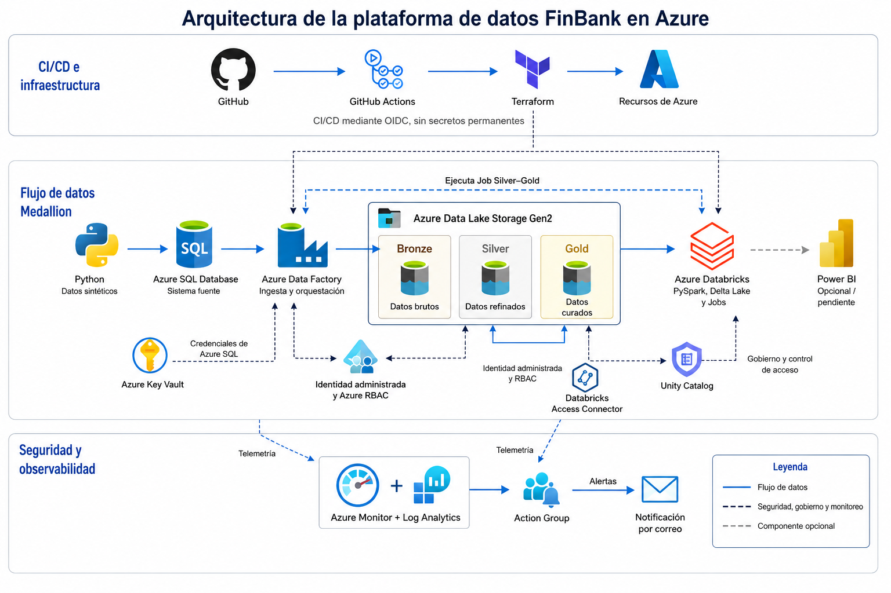
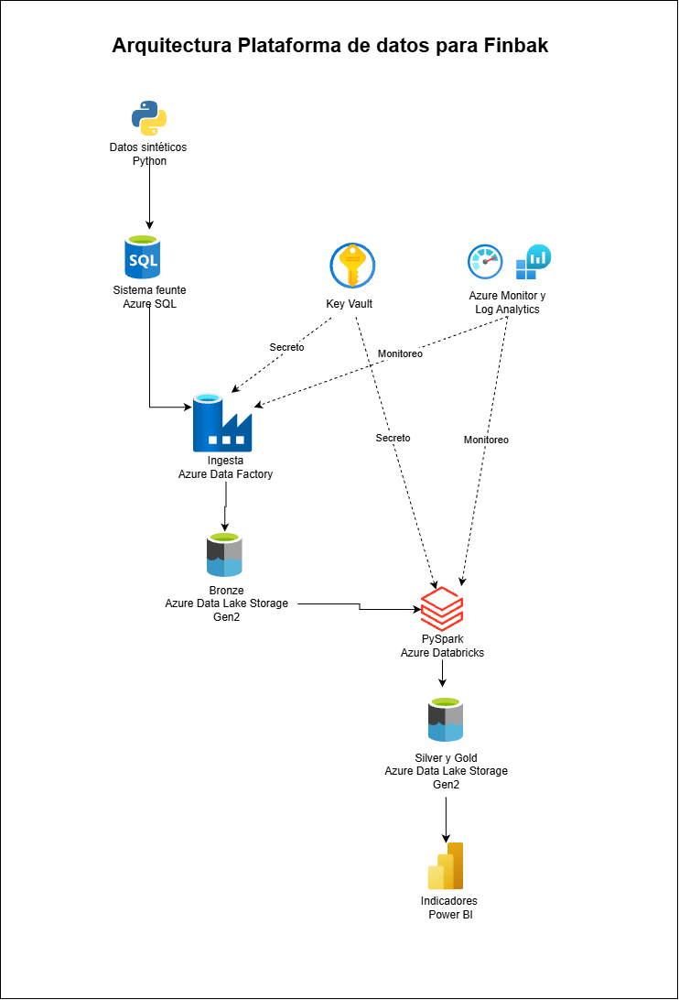

# Arquitectura de la plataforma de datos FinBank

La plataforma de datos de FinBank está implementada sobre Microsoft Azure mediante una arquitectura Medallion. La solución integra infraestructura como código, ingesta incremental, procesamiento distribuido, gobierno, seguridad, observabilidad y automatización CI/CD.

## Arquitectura final

La arquitectura se organiza en tres áreas:

- CI/CD e infraestructura.
- Flujo de datos Medallion.
- Seguridad, gobierno y observabilidad.

## Flujo de datos

1. Python genera datos financieros sintéticos de forma reproducible.
2. Azure SQL Database simula el sistema transaccional de FinBank.
3. Azure Data Factory realiza la ingesta incremental hacia Bronze.
4. Azure Data Factory ejecuta el Job Silver–Gold de Azure Databricks.
5. Azure Databricks utiliza PySpark para limpiar, validar y transformar los datos.
6. Los datos refinados se publican en Silver mediante tablas Delta.
7. El modelo dimensional, los KPI y los marts analíticos se publican en Gold.
8. Power BI se plantea como una milla extra opcional para consumir la capa Gold.

Las capas Bronze, Silver y Gold se encuentran en una misma cuenta de Azure Data Lake Storage Gen2, separadas mediante sistemas de archivos.

## Infraestructura y CI/CD

La infraestructura se define mediante Terraform y utiliza un estado remoto almacenado en Azure Storage.

GitHub Actions implementa:

- validaciones automáticas de Python, JSON, YAML y Terraform;
- detección de posibles secretos;
- autenticación ante Azure mediante OIDC;
- planificación y despliegue protegido del ambiente `dev`;
- ejecución sin secretos permanentes en GitHub.

El ambiente `dev` está desplegado y validado. El ambiente `prod` permanece parametrizado, pero no se aprovisiona durante la prueba.

## Seguridad y gobierno

La solución incorpora:

- Azure Key Vault para las credenciales de Azure SQL;
- identidades administradas y Azure RBAC;
- Databricks Access Connector para acceder a ADLS Gen2;
- Unity Catalog para gobierno y control de acceso;
- separación de responsabilidades entre ingesta, procesamiento y consumo;
- exclusión de credenciales e identificadores sensibles del repositorio.

## Observabilidad

Azure Data Factory y Azure Databricks envían telemetría hacia Azure Monitor y Log Analytics.

Las reglas de alerta detectan fallos de pipelines y desencadenadores. Azure Monitor utiliza un Action Group para enviar notificaciones por correo ante incidentes operacionales.

## Decisiones técnicas

| Decisión | Implementación |
|---|---|
| Plataforma cloud | Microsoft Azure |
| Infraestructura como código | Terraform |
| Patrón de almacenamiento | Arquitectura Medallion |
| Ingesta y orquestación | Azure Data Factory |
| Procesamiento | Azure Databricks y PySpark |
| Formato analítico | Delta Lake |
| Gobierno | Unity Catalog |
| Administración de secretos | Azure Key Vault |
| Identidades y permisos | Microsoft Entra ID, identidades administradas y Azure RBAC |
| Observabilidad | Azure Monitor y Log Analytics |
| CI/CD | GitHub Actions y OIDC |
| Ambiente desplegado | `dev` |
| Consumo analítico | Power BI como mejora opcional |

## Evolución del diseño

### Diseño inicial

El diseño inicial permitió identificar el sistema fuente, la ingesta, las capas Medallion, el procesamiento con PySpark y el consumo analítico.

### Diseño final

El diseño final incorporó y corrigió:

- una única cuenta de ADLS Gen2 para Bronze, Silver y Gold;
- la orquestación ADF–Databricks;
- identidades administradas y RBAC;
- Databricks Access Connector;
- Unity Catalog;
- monitoreo, alertas y notificaciones;
- infraestructura con Terraform;
- CI/CD mediante GitHub Actions y OIDC;
- diferenciación de Power BI como componente opcional.