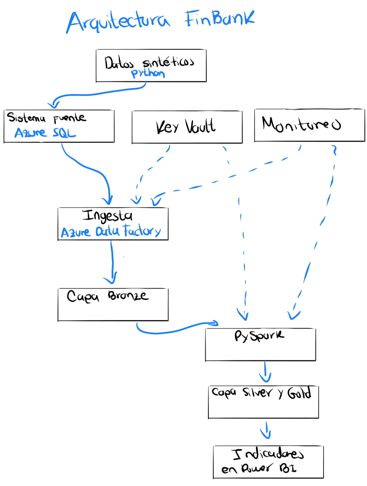

# Arquitectura de la plataforma de datos FinBank

La solución propuesta para desarrollar la plataforma de datos para FinBank seguirá una arquitectura Medallion y será desplegada mediante Terraform

## Evolución del diseño

    ### Boceto inicial
    El siguiente boceto representa el primer análisis conceptual del flujo de datos y algunos componentes de la solución

    

    El boceto permitió identificar inicialmente:

    - El origen sintético de los datos.
    - Azure SQL como sistema fuente.
    - Azure Data Factory como servicio de ingesta.
    - La separación de los datos en capas Bronze, Silver y Gold.
    - El uso de PySpark para las transformaciones.
    - La visualización de indicadores en Power BI.
    - La necesidad de administrar secretos y monitorear la plataforma.

## Flujo general de datos
1. Un programa desarrollado en Python genera datos financieros sintéticos
2. Los datos se cargan en una base de datos de Azure SQL que simula el sistema transaccional de FinBank
3. Azure Data Factory extrae la información desde Azure SQL
4. Los datos originales se almacenan en la capa Bronze
5. Se ejecutan transformaciones con PySpark
6. Los datos depurados y estandarizados se almacenan en la capa Silver
7. Los indicadores y agregaciones de negocio se publican en la capa Gold
8. Power BI consume los datos de Gold para construir el tablero de indicadores

## 7. Decisiones iniciales
- Plataforma cloud: Microsoft Azure.
- Región inicial: East US.
- Estrategia de despliegue: Terraform.
- Patrón de almacenamiento: arquitectura Medallion
- Transformaciones: PySpark
- Entorno inicial: desarrollo.
- Prioridad operativa: minimizar costos y eliminar recursos temporales después de las validaciones.
- Consumo inicial: Power BI sobre datos preparados en la capa Gold.

## Evolución pendiente
Durante las siguientes etapas se incorporarán:
- Diagrama técnico definitivo.
- Convención de nombres de los recursos.
- Inventario de recursos de Azure.
- Diseño de red y accesos.
- Roles y permisos específicos.
- Formatos y estructura de almacenamiento.
- Modelo de datos.
- Indicadores de negocio.
- Evidencias del despliegue y ejecución.