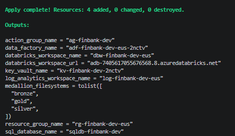
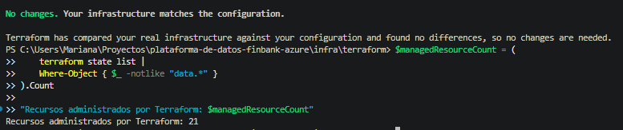
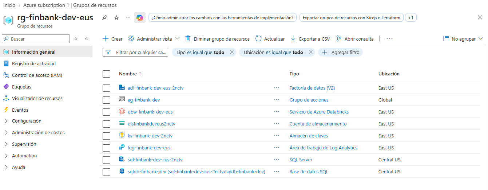

# Evidencias del despliegue de infraestructura
Este archivo permitirá evidenciar el despliegue de la infraestructura

## 1. Aplicación de Terraform

Terraform completó el despliegue de los recursos pendientes sin modificar ni destruir la infraestructura previamente creada.

El despliegue se realizó de manera incremental debido al registro inicial de proveedores de Azure y a restricciones de disponibilidad regional. Terraform conservó el estado de los recursos creados correctamente y continuó únicamente con los recursos pendientes, es por ello que en la captura solo se tiene el registro de 4 added.

## 2. Consistencia del estado

Una ejecución posterior de `terraform plan` confirmó que la infraestructura desplegada coincide con la configuración del repositorio y no requiere cambios.

Terraform administra 21 recursos de la solución.

## 3. Recursos desplegados en Azure

El grupo de recursos contiene los servicios principales de la plataforma:

- Azure Data Factory.
- Azure Monitor Action Group.
- Azure Databricks.
- Azure Data Lake Storage Gen2.
- Azure Key Vault.
- Log Analytics Workspace.
- Azure SQL Server.
- Azure SQL Database.

Azure SQL fue desplegado en Central US debido a restricciones de aprovisionamiento encontradas en East US y East US 2 para la suscripción utilizada.

> Las capturas fueron recortadas para evitar la publicación de credenciales, correos e identificadores de suscripción.