# Evidencias de la ingesta Bronze

Esta carpeta contiene las evidencias de configuración, ejecución y validación de la canalización incremental desde Azure SQL Database hacia la capa Bronze de Azure Data Lake Storage Gen2.

## Evidencias disponibles

### 1. Configuración incremental

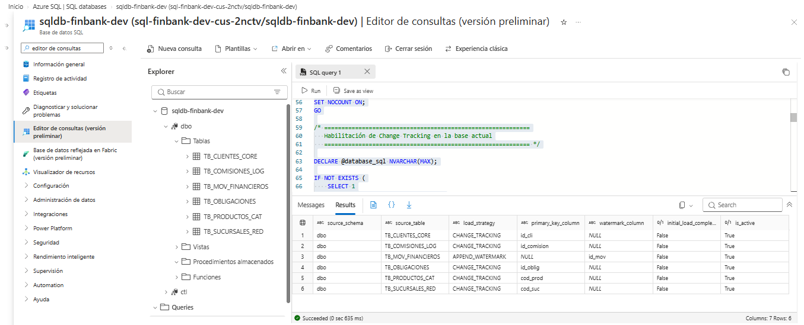

Configuración de las seis tablas fuente y de las estrategias Change Tracking y watermark.

### 2. Controles de Bronze

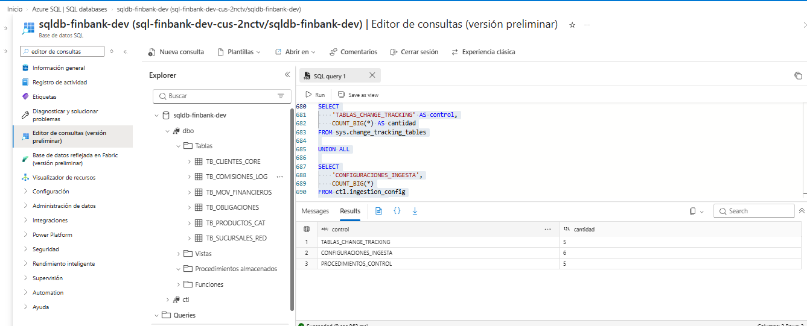

Validación de las configuraciones, tablas con Change Tracking y procedimientos almacenados de control.

### 3. Servicios vinculados

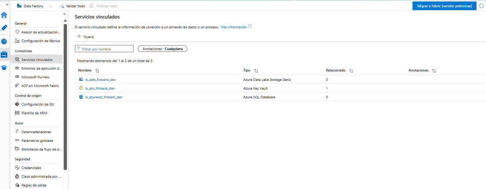

Servicios vinculados para Azure SQL Database, Azure Key Vault y Azure Data Lake Storage Gen2.

### 4. Ejecución inicial

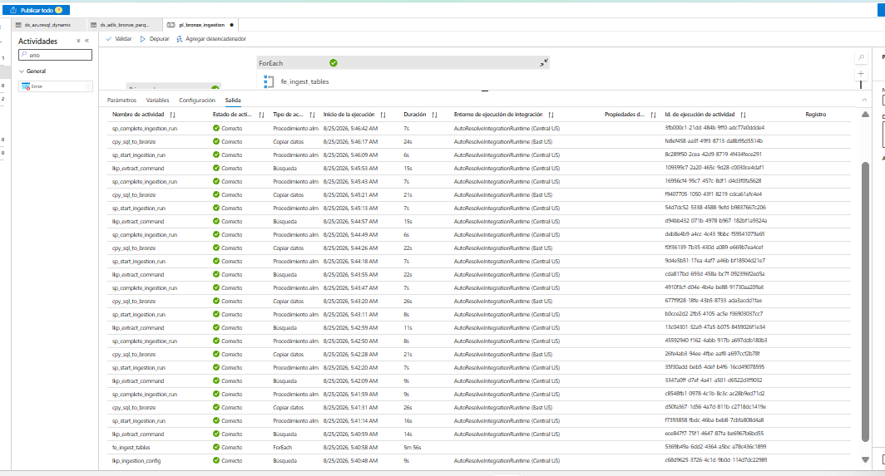

Ejecución completa de las seis tablas con todas las actividades en estado correcto.

### 5. Métricas de movimientos

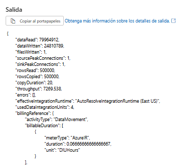

Resultado de la copia de 500.000 movimientos financieros desde Azure SQL hacia ADLS Gen2.

### 6. Directorios de las tablas

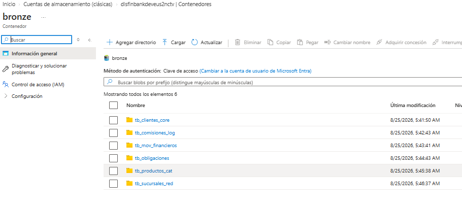

Directorios creados para las seis tablas fuente dentro del contenedor Bronze.

### 7. Partición Parquet de movimientos

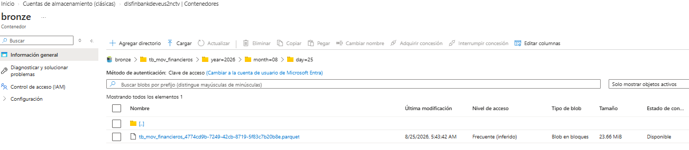

Archivo Parquet de movimientos almacenado mediante particiones de año, mes y día.

### 8. Log de la ejecución inicial

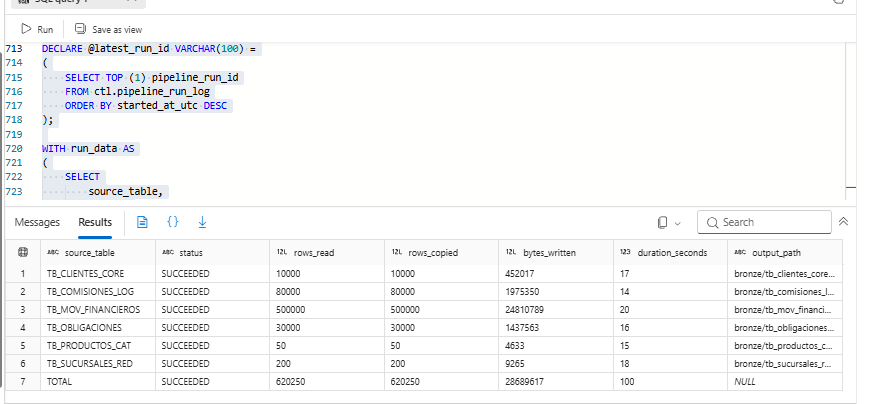

Conteos, métricas, rutas y estados registrados para la carga inicial de 620.250 filas.

### 9. Cambios incrementales controlados

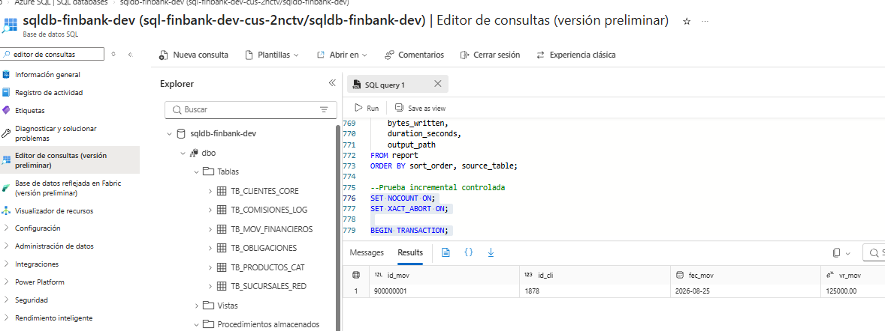

Modificación de un cliente e inserción de un movimiento utilizadas para validar la extracción incremental.

### 10. Ejecución incremental

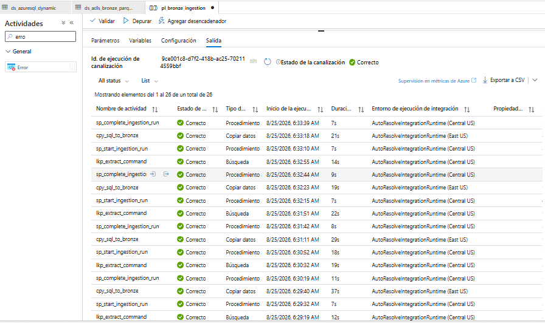

Segunda ejecución de la canalización, finalizada correctamente para las seis tablas.

### 11. Log de la ejecución incremental

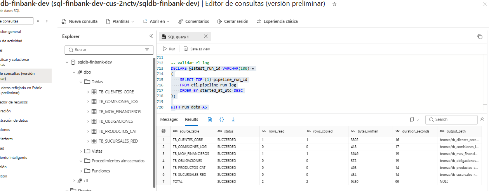

La ejecución incremental procesó dos registros: un cliente modificado y un movimiento nuevo. Las demás tablas registraron cero filas nuevas.

> Las capturas fueron seleccionadas para evidenciar la configuración y los resultados sin publicar contraseñas, secretos ni valores sensibles.
