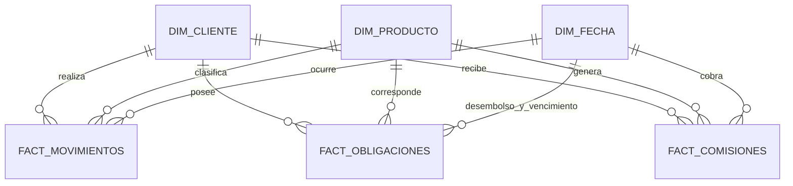

# Modelo dimensional Gold

## Objetivo

El modelo Gold transforma las tablas operativas Silver en estructuras
dimensionales optimizadas para analisis bancario y consumo desde Power BI.

## Relaciones principales

`dim_sucursal` se publica como dimension conformada para analisis geograficos y
futuras fuentes que incorporen una llave explicita de sucursal. Las tablas
transaccionales actuales solo proporcionan ciudad y no permiten asignar una
sucursal sin introducir una relacion artificial.

## Grano de las tablas

| Tabla | Grano |
|---|---|
| `dim_fecha` | Una fila por fecha del rango observado |
| `dim_cliente` | Una fila por cliente vigente |
| `dim_producto` | Una fila por producto del catalogo |
| `dim_sucursal` | Una fila por punto de atencion |
| `fact_movimientos` | Un movimiento valido y deduplicado |
| `fact_obligaciones` | Una obligacion financiera |
| `fact_comisiones` | Un cobro de comision |
| `mart_cliente_360` | Una fila agregada por cliente |
| `mart_producto_rendimiento` | Una fila agregada por producto |
| `kpi_resumen_bancario` | Una fila para la fecha de corte |

## Decisiones de modelado

### Movimiento valido

`fact_movimientos` contiene solamente movimientos dentro del periodo oficial.
Las filas fuera de rango permanecen disponibles en Silver y en el esquema de
calidad, pero no afectan los indicadores Gold.

### Llaves

Las llaves naturales controladas (`id_cli`, `cod_prod`, `id_mov`,
`id_oblig` e `id_comision`) se conservan como llaves analiticas estables. La
dimension de fecha utiliza una llave entera con formato `yyyyMMdd`.

### Dimension sucursal

No se relaciona una transaccion con una sucursal basandose unicamente en ciudad,
porque una ciudad puede contener multiples oficinas. Se evita asi fabricar una
relacion no demostrable desde la fuente.

### Privacidad

Gold no publica nombres, apellidos, documentos, fechas de nacimiento ni numeros
de cuenta en texto claro. El identificador de cuenta se transforma con SHA-256
y el analisis de clientes utiliza atributos segmentados.

### Idempotencia

Las tablas dimensionales, de hechos y marts se reconstruyen de forma
deterministica mediante `overwrite`. Las metricas de ejecucion se agregan a
`gold.gold_run_metrics` usando un `run_id` independiente.

## Consumo analitico

- `kpi_resumen_bancario`: tarjetas ejecutivas.
- `mart_cliente_360`: segmentacion, riesgo, mora y actividad de clientes.
- `mart_producto_rendimiento`: comparacion de productos, cartera e ingresos.
- `fact_movimientos`: tendencias temporales, canales y alertas.
- `fact_obligaciones`: exposicion y envejecimiento de cartera.
- `fact_comisiones`: evolucion de ingresos por comisiones.
