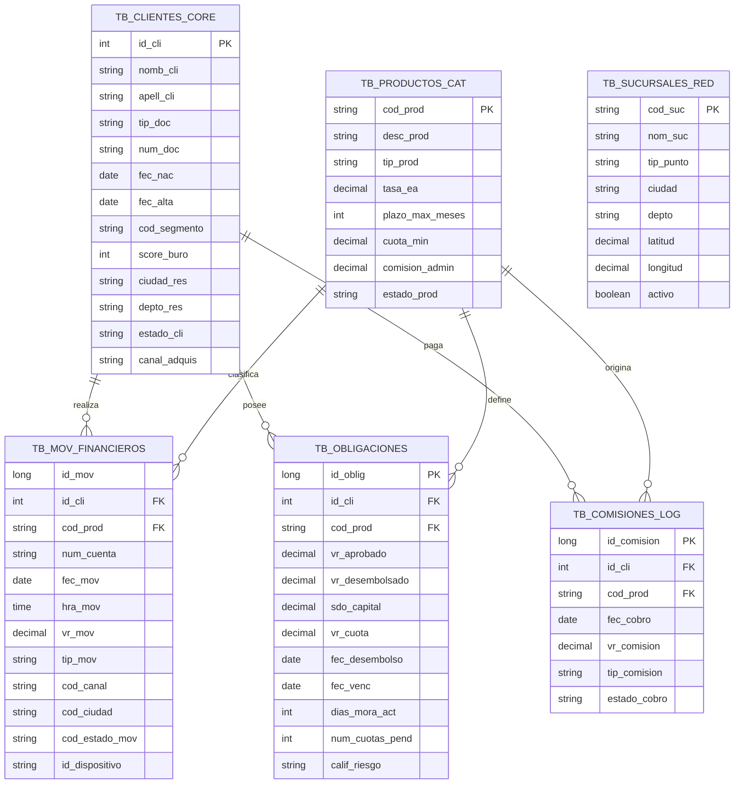

# Modelo entidad-relación de las tablas fuente

Este modelo representa las seis estructuras del sistema transaccional de FinBank utilizadas para generar y cargar los datos sintéticos.

## Relaciones

- Un cliente puede tener múltiples movimientos, obligaciones y comisiones.
- Un producto puede aparecer en múltiples movimientos, obligaciones y comisiones.
- `TB_SUCURSALES_RED` funciona como catálogo geográfico de puntos de atención.
- La fuente no proporciona `cod_suc` en `TB_MOV_FINANCIEROS`; por tanto, no se inventa una llave foránea entre ambas tablas. Su integración analítica se realizará por ciudad y reglas de homologación en Silver.
- `id_mov` no se declara como llave primaria física en Azure SQL porque el conjunto sintético incluye duplicados intencionales que deben llegar a Bronze para ser detectados.

## Datos sensibles

`num_doc`, nombres y apellidos se consideran datos sensibles aunque sean sintéticos. En Silver se aplicará enmascaramiento o tokenización antes de exponerlos a consumidores analíticos.
